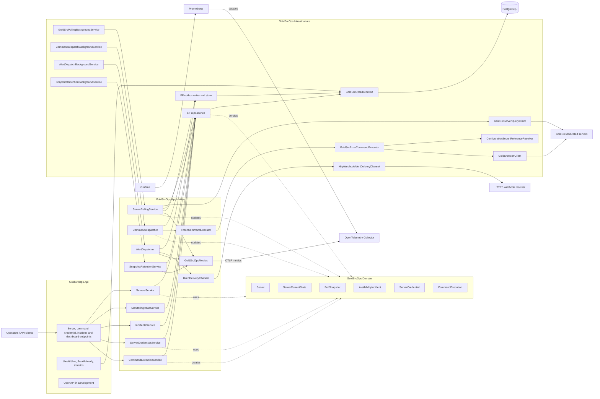
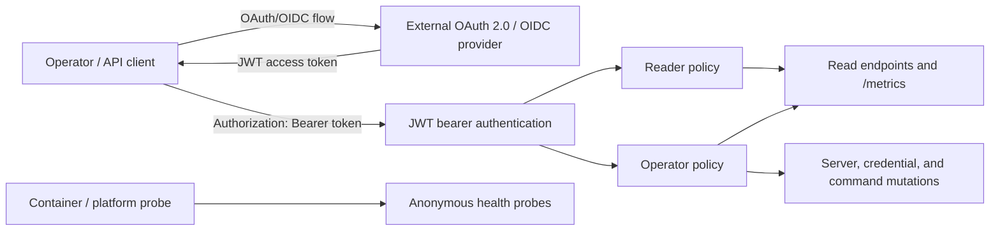
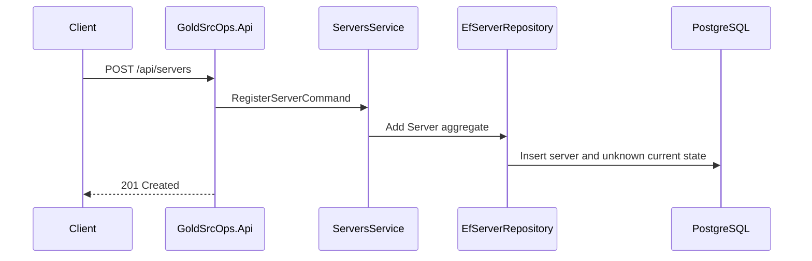
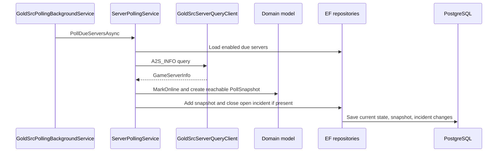
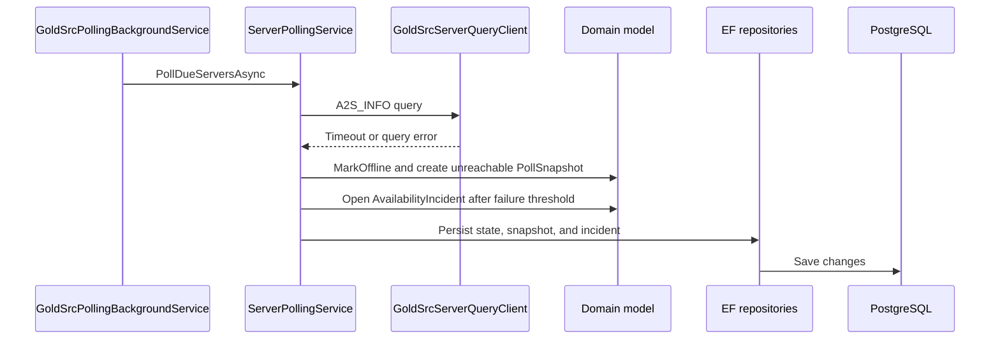
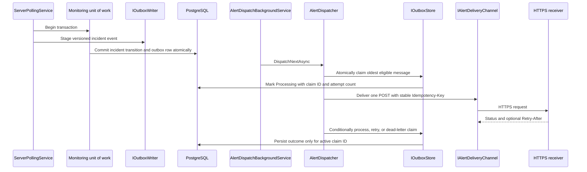
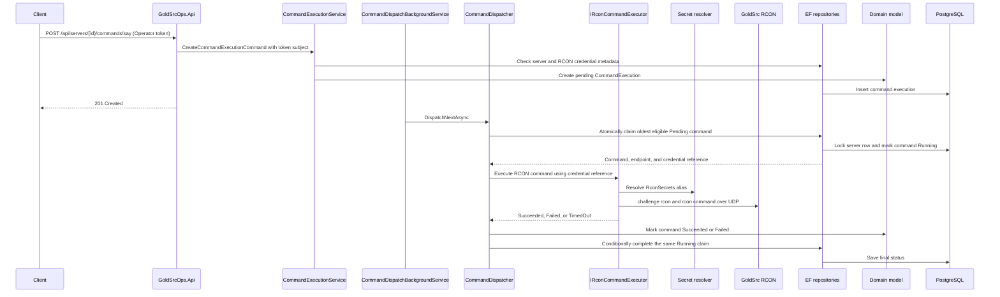
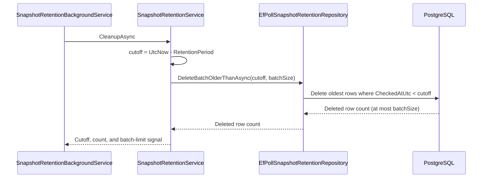

# GoldSrcOps Architecture

GoldSrcOps is currently a modular monolith. The API host owns HTTP endpoints,
background polling, command and alert dispatch, snapshot and outbox retention,
persistence wiring, health checks, and metrics export in one deployable
process. The internal boundaries still separate API contracts, application
orchestration, domain rules, and infrastructure integrations.

## System Overview

## Project Boundaries

- `GoldSrcOps.Api` contains the host, JWT bearer authentication, endpoint
  authorization policies, Minimal API endpoint mapping, health
  endpoints, Prometheus scraping endpoint, and OpenTelemetry configuration.
- `GoldSrcOps.Contracts` contains HTTP request and response records that define
  the public API shape.
- `GoldSrcOps.Application` coordinates use cases such as server registration,
  credential metadata, command queueing, monitoring reads, incident reads, and
  polling, alert dispatch, and snapshot retention. It owns the outbox and alert
  delivery boundaries and the provider-independent availability normalizer and
  expected-slot evaluator, but depends on interfaces, not EF Core, UDP, or HTTP
  transport details.
- `GoldSrcOps.Domain` owns the core server state model and transition rules:
  server status, poll snapshots, availability incidents, credential references,
  and command execution records.
- `GoldSrcOps.Infrastructure` implements EF Core persistence, PostgreSQL
  configuration, the GoldSrc A2S query client, the GoldSrc RCON executor/client,
  the HTTPS webhook channel, local secret-reference resolution, the system
  clock, and the polling, command-dispatch, alert-dispatch, and retention
  background workers.
- `GoldSrcOps.AvailabilityExporter` is a separately invoked operator tool. It
  reads bounded managed-monitor metrics, writes create-only canonical JSONL,
  and runs the application-layer evaluator outside the production API runtime.
  Provider credentials are process environment inputs and raw evidence remains
  outside PostgreSQL and Git.

## Security Boundary

The API enforces the control-plane security boundary defined in
`docs/security.md`.

GoldSrcOps remains a resource server and does not issue production tokens or
store user accounts. Production token issuance belongs to an external identity
provider. Local development uses project-specific tokens from
`dotnet user-jwts` only.

The `Reader` policy permits read endpoints and metrics. The `Operator` policy
permits all reads plus server, credential, and command mutations. The fallback
policy is `Operator`, so a new endpoint is not exposed to readers by accident.
Only bounded liveness and readiness probes remain anonymous.

Command audit identity comes from the authenticated token subject. Callers can
no longer supply `RequestedBy` in command request bodies. The endpoint matrix,
HTTP behavior, and required security tests are specified in `docs/security.md`.

## Deployment Model

The current deployment runs exactly one active polling worker. If multiple API
instances are deployed, only one may use `Polling:Enabled=true`; HTTP-only
instances must set `Polling__Enabled=false`. The current polling scheduler does
not use a distributed claim, so running multiple active pollers could duplicate
snapshots and incident transitions.

This constraint does not apply to command dispatch. PostgreSQL atomically
claims commands and serializes each server queue, so multiple command workers
or API instances may dispatch commands concurrently. Horizontal polling will
require an expiring database claim or lease before this singleton constraint can
be removed.

Alert dispatch is also multi-instance safe. PostgreSQL atomically claims due
outbox rows, conditional completion uses the active claim ID, and older pending
or processing messages preserve ordering per incident. Concurrency is bounded
per process, so receiver capacity planning must include every enabled replica.

Snapshot cleanup is row-level idempotent, but multiple active retention workers
would perform redundant selection and can contend on the same oldest rows. A
multi-replica deployment should therefore enable `SnapshotRetention` on one
worker process only. This is an efficiency constraint rather than a data
correctness boundary.

EF Core stores `__EFMigrationsHistory` explicitly in `public`. PostgreSQL's
default `$user, public` search path would otherwise start resolving an
unqualified history table into the `goldsrcops` application schema after that
schema is created, because the development role has the same name. Pinning the
history schema keeps repeated migration runs idempotent.

## Runtime Flows

### Register Server

### Polling Success

Map, version, and failure text from the external server are normalized and
bounded by Domain before persistence. The EF Core model uses the same limits so
a malformed response cannot exceed the current-state, snapshot, or incident
columns.

### Polling Failure And Incident Detection

When an incident opens or closes, polling serializes a versioned alert payload
and stages an outbox row in the same EF Core transaction as the incident
transition. A rollback removes both changes, and the uniqueness constraint
prevents duplicate event types for the same incident.

### Deliver Incident Alert

The webhook call runs outside the database transaction. This gives at-least-once
delivery: an ambiguous network outcome may be retried, and the receiver must
deduplicate by event ID. Expired claims are recovered, final attempts move
directly to dead letter, and processed rows are deleted in bounded batches. See
`docs/v2-alert-outbox.md` and `docs/alert-delivery.md` for the complete protocol.

### Queue And Execute Command

The PostgreSQL claim locks the server row with `FOR UPDATE SKIP LOCKED`. This
allows workers and API replicas to execute commands for different servers in
parallel while serializing each server queue. A stale `Running` command is
marked `Failed` rather than retried automatically because RCON does not provide
an idempotency key; conditional completion prevents a late worker from
overwriting that recovery result.

The credential API accepts a validated alias. Application stores it as a
canonical `rcon-secret://<alias>` reference, and Infrastructure resolves only
the matching `RconSecrets:<alias>` configuration key. Raw RCON passwords are not
stored in the database or returned by API contracts. Arbitrary environment or
configuration paths cannot be selected through the API. Missing, legacy, or
unsupported references fail the command before a network packet is sent.

### Snapshot Retention

Each pass executes one bounded delete. Ordering by `CheckedAtUtc` and `Id`
makes backlog draining deterministic, and the strict cutoff retains a snapshot
whose timestamp equals the boundary. Current state and availability incidents
are stored separately and are not part of the delete. See
`docs/snapshot-retention.md` for configuration and capacity guidance.

## Observability

- `/health/live` is a lightweight liveness probe and intentionally does not run
  dependency checks.
- `/health/ready` runs readiness checks tagged as `ready`, including database
  connectivity through `GoldSrcOpsDbContext`.
- `/metrics` exposes ASP.NET Core, runtime, and GoldSrcOps application metrics
  in Prometheus format through OpenTelemetry. It remains authenticated for v2
  compatibility and rollback.
- The production-default path exports metrics by private OTLP gRPC to the
  OpenTelemetry Collector. Prometheus scrapes only the Collector's private
  exporter and internal telemetry endpoints, and Grafana queries Prometheus.
  None of those service ports is published on the host.
- Application metrics currently cover polling runs, server poll attempts by
  result, incident transitions, queued commands, dispatched commands, completed
  command dispatches by result, recovered interrupted commands, and
  snapshot-retention runs, deletions, failures, and duration. Alert instruments
  cover enqueueing, attempts, delivery, retries, dead letters, expired-claim
  recovery, duration, backlog count and age, and processed-row deletion.
- Structured RCON lifecycle events expose safe command and server identifiers,
  type, status, result, and duration while excluding payloads, secret references,
  passwords, and executor response text.
- Command dispatch remains auditable through `CommandExecution` records in
  addition to the Prometheus metrics.

## Testing Shape

The current test suite keeps the layers visible:

- domain and application unit tests cover state transitions and orchestration
  rules;
- API integration tests cover endpoint behavior through `WebApplicationFactory`;
- deterministic polling integration tests replace the A2S query client and
  clock while using production DI and EF-backed repositories;
- command execution tests cover background dispatch orchestration, secret-reference
  resolution, structured-log safety, GoldSrc RCON packet handling, and a
  synthetic UDP RCON flow;
- telemetry tests cover metric recording and direct Prometheus exposure, while
  the production container smoke observes application and ASP.NET Core metrics
  after the private Collector boundary and checks Collector-outage readiness;
- alert tests cover transactional enqueueing, dispatcher outcomes, retry and
  dead-letter policy, sanitized logs, the synthetic HTTP boundary, and
  Prometheus exposure;
- PostgreSQL-backed integration tests use Testcontainers and apply EF Core
  migrations against a real PostgreSQL provider, including concurrent
  per-server claims, interrupted-command recovery, and bounded snapshot
  retention with strict cutoff behavior. They also cover alert migration,
  atomic incident/outbox commit, concurrent outbox claims, per-incident
  ordering, recovery, statistics, and retention, and repeat migration
  application when the database role and application schema share a name.
