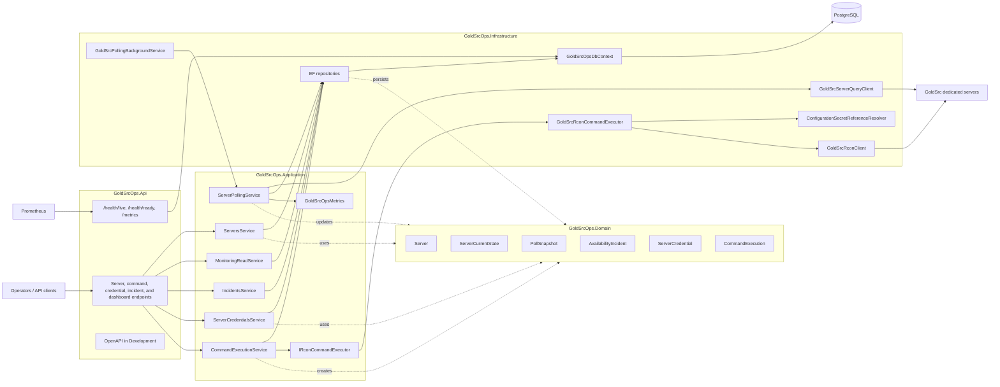
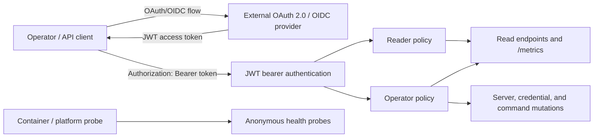
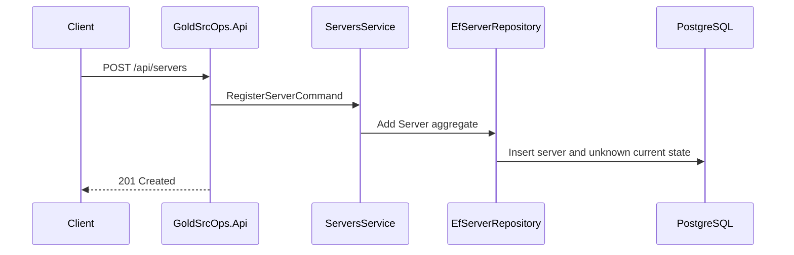
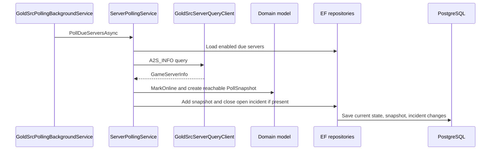
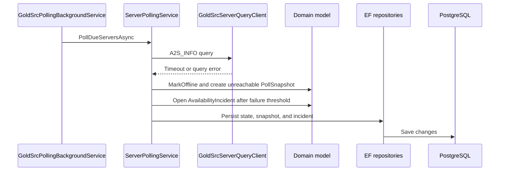
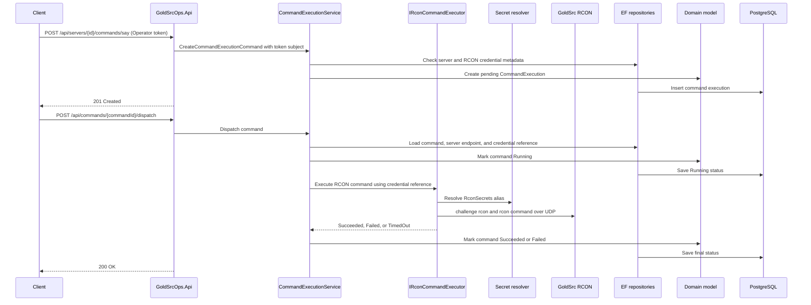

# GoldSrcOps Architecture

GoldSrcOps is currently a modular monolith. The API host owns HTTP endpoints,
background polling, persistence wiring, health checks, and metrics export in one
deployable process. The internal boundaries still separate API contracts,
application orchestration, domain rules, and infrastructure integrations.

## System Overview

## Project Boundaries

- `GoldSrcOps.Api` contains the host, JWT bearer authentication, endpoint
  authorization policies, Minimal API endpoint mapping, health
  endpoints, Prometheus scraping endpoint, and OpenTelemetry configuration.
- `GoldSrcOps.Contracts` contains HTTP request and response records that define
  the public API shape.
- `GoldSrcOps.Application` coordinates use cases such as server registration,
  credential metadata, command queueing, monitoring reads, incident reads, and
  polling. It depends on repository and protocol interfaces, not EF Core or UDP
  details.
- `GoldSrcOps.Domain` owns the core server state model and transition rules:
  server status, poll snapshots, availability incidents, credential references,
  and command execution records.
- `GoldSrcOps.Infrastructure` implements EF Core persistence, PostgreSQL
  configuration, the GoldSrc A2S query client, the GoldSrc RCON executor/client,
  local secret-reference resolution, the system clock, and the background
  polling worker.

## Security Boundary

The API enforces the control-plane security boundary defined in
`docs/security.md`.

GoldSrcOps remains a resource server and does not issue production tokens or
store user accounts. Production token issuance belongs to an external identity
provider. Local development uses project-specific tokens from
`dotnet user-jwts` only.

The `Reader` policy permits read endpoints and metrics. The `Operator` policy
permits all reads plus server, credential, and command mutations. The fallback
policy is `Operator`, so a new endpoint is not exposed to readers by accident.
Only bounded liveness and readiness probes remain anonymous.

Command audit identity comes from the authenticated token subject. Callers can
no longer supply `RequestedBy` in command request bodies. The endpoint matrix,
HTTP behavior, and required security tests are specified in `docs/security.md`.

## Runtime Flows

### Register Server

### Polling Success

### Polling Failure And Incident Detection

### Queue And Dispatch Command

The credential API accepts a validated alias. Application stores it as a
canonical `rcon-secret://<alias>` reference, and Infrastructure resolves only
the matching `RconSecrets:<alias>` configuration key. Raw RCON passwords are not
stored in the database or returned by API contracts. Arbitrary environment or
configuration paths cannot be selected through the API. Missing, legacy, or
unsupported references fail the command before a network packet is sent.

## Observability

- `/health/live` is a lightweight liveness probe and intentionally does not run
  dependency checks.
- `/health/ready` runs readiness checks tagged as `ready`, including database
  connectivity through `GoldSrcOpsDbContext`.
- `/metrics` exposes ASP.NET Core, runtime, and GoldSrcOps application metrics
  in Prometheus format through OpenTelemetry.
- Application metrics currently cover polling runs, server poll attempts by
  result, incident transitions, queued commands, dispatched commands, and
  completed command dispatches by result.
- Command dispatch remains auditable through `CommandExecution` records in
  addition to the Prometheus metrics.

## Testing Shape

The current test suite keeps the layers visible:

- domain and application unit tests cover state transitions and orchestration
  rules;
- API integration tests cover endpoint behavior through `WebApplicationFactory`;
- deterministic polling integration tests replace the A2S query client and
  clock while using production DI and EF-backed repositories;
- command execution tests cover fake dispatch orchestration, secret-reference
  resolution, GoldSrc RCON packet handling, and a synthetic UDP RCON flow;
- telemetry tests cover command metric recording and Prometheus exposure;
- PostgreSQL-backed integration tests use Testcontainers and apply EF Core
  migrations against a real PostgreSQL provider.
