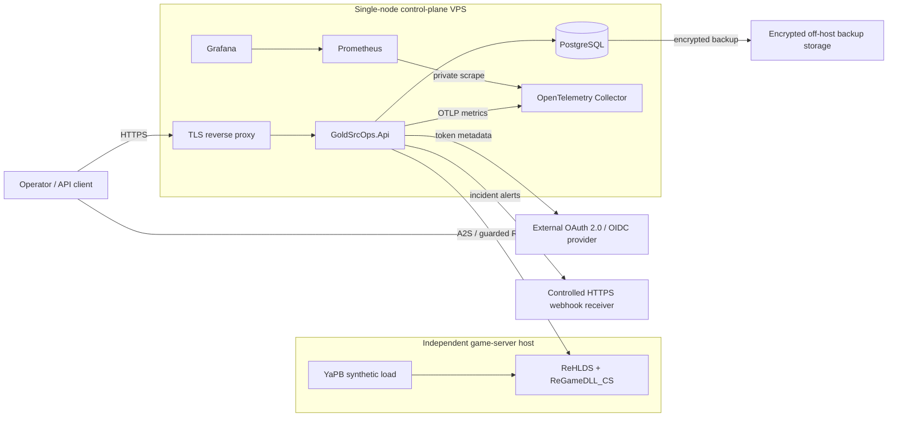

# GoldSrcOps v2.3 Reference Production Deployment Plan

## Status

Architecture and delivery plan accepted on 2026-08-28. Slice 1 was integrated
through [pull request #26](https://github.com/tov-vl/gold-src-ops/pull/26) as
revision `8c56d6a`; its
[post-merge run](https://github.com/tov-vl/gold-src-ops/actions/runs/33187736358)
passed `Quality Gate` and `Container Smoke`. Slice 1 now also accepts strict
release-candidate tags and can promote a matching verified candidate digest to a
stable tag without rebuilding it. Its first published registry digest remains
future publication evidence. Slice 2 now has a provider-independent
controlled game-server baseline contract, a conditional game-host selection,
and local target-runtime evidence. Slice 3 now has a provider-independent
Compose and preflight contract plus a one-shot migration action under
`ops/production`: Caddy is the only public service, the API trusts one configured
proxy address, PostgreSQL is isolated behind a shared Unix-domain socket, and
the same API image carries the serialized EF Core migration bundle. Client-side
encrypted off-host backup, repository checking, and isolated restore-rehearsal
automation are also implemented and exercised by `Container Smoke`. The
repository now includes a read-only host-readiness audit for Linux, systemd,
Docker, time synchronization, storage, UFW, public listeners, container port
publication, and optional external dependencies. Deterministic snapshot
coverage cannot count as target evidence. Infrastructure purchase, pre-purchase
verification, off-host repository execution, provisioning, and all live
target-environment evidence remain pending.

Architecture Decisions 16 through 18 define the provider-independent topology,
the production OTLP metrics path, and the PostgreSQL recovery baseline. This
document turns those decisions into small reviewable slices and an
evidence-based definition of done.

## Goal

Operate one persistent GoldSrcOps environment across a real external network
boundary:

- one controlled Counter-Strike 1.6 server running ReHLDS and ReGameDLL_CS;
- one single-node VPS control plane running GoldSrcOps and its operational
  dependencies;
- production HTTPS and external identity;
- private OTLP metrics through an OpenTelemetry Collector into Prometheus and
  Grafana;
- immutable rollout, backup, restore, rollback, and failure/recovery evidence.

This is a reference production baseline, not a high-availability claim. Its
purpose is to prove the current application contracts under real operational
conditions and create reliable input for the later operator UI and portfolio
showcase.

## Delivery Order And Status

This is the canonical near-term execution order. Detailed deliverables and
verification remain in the reviewable slices below; `docs/backlog.md` records
only their current status and links back here.

1. Completed: integrate the read-only host-readiness audit and deployment
   checklist.
2. Implementation ready: publish immutable release-candidate images such as
   `v2.3.0-rc.1` to GHCR without treating them as stable releases. The first
   signed candidate tag and registry digest remain pending.
3. Create the S3-compatible backup repository and keep the restic key outside
   the future VPS failure domain.
4. Provision the control-plane VPS, apply the reviewed hardening procedure, and
   collect live host-preflight evidence.
5. Configure DNS, Caddy certificate issuance, and the external identity
   provider, then verify the public Reader and Operator boundary.
6. Start PostgreSQL, create and restore the first off-host backup, apply the
   image-contained migration bundle, and start the API and Caddy only after all
   gates pass.
7. Provision the controlled MyArena game VDS and verify external A2S, guarded
   RCON, address stability, source-address preservation, and ReHLDS recovery.
8. Deploy the OpenTelemetry Collector, Prometheus, and Grafana on private
   telemetry paths with health coverage.
9. Run the controlled recovery exercise and retain at least 72 hours of soak
   evidence.
10. Record readiness evidence, initial SLI and SLO values, rollback references,
    and publish stable `v2.3.0` only after the release gate passes.

Steps may be prepared in parallel, but their production evidence must respect
this order. In particular, a stable release is not used as a substitute for a
release candidate, and paid infrastructure is not provisioned before the
repository-side host gate is reviewable.

## Reference Topology

The diagram describes ownership and traffic direction. It does not require a
specific game host, VPS vendor, identity provider, reverse proxy, registry, or
backup service.

## Trust Boundaries

1. Public ingress terminates at the TLS reverse proxy. Only the intended HTTPS
   API surface is routed to GoldSrcOps.
2. PostgreSQL, OTLP receivers, the Collector Prometheus endpoint, and
   administrative Grafana access remain private. They are not Internet-facing
   convenience endpoints.
3. Production JWTs come from an external standards-based provider. Local
   `dotnet user-jwts` tokens remain Development-only.
4. A2S is read-only and may cross the public Internet. RCON has no transport
   confidentiality and requires stronger treatment: prefer a private tunnel;
   otherwise require a source-IP allowlist and an explicit residual-risk record.
5. Database credentials, RCON passwords, webhook authorization, identity-client
   secrets, and backup keys come from deployment secret injection. They must not
   enter Git, image layers, Compose files, command output, logs, or telemetry.
6. The VPS and its local volumes are one failure domain. Database backups must
   be encrypted, stored elsewhere, and restored in a rehearsal.

## Provider Selection Gate

Do not encode a provider name into application contracts. Before purchasing a
game-server plan or VPS, record a short comparison against these requirements:

- supported ReHLDS and ReGameDLL_CS versions or sufficient file access to
  install pinned builds;
- ability to install and configure YaPB;
- stable public query endpoint and configurable A2S and RCON ports;
- private networking or source-IP filtering for RCON;
- process restart, console, logs, file backup, and restore capabilities;
- outbound and inbound firewall constraints;
- target region and observed latency from the planned VPS;
- documented resource limits, backup responsibility, and monthly cost;
- an exit path that does not require GoldSrcOps code changes.

Provider-specific setup may be documented in an operational appendix after the
selection, but the reference deployment and core code remain portable.

## Reviewable Delivery Slices

### Slice 0: Architecture And Delivery Contract

Deliverables:

- Architecture Decisions 16 through 18.
- This implementation and evidence plan.
- Updated backlog, project brief, deployment status, and documentation map.

Verification:

- Documentation links resolve.
- Current behavior is distinguished from planned v2.3 behavior.
- No provider purchase, production credential, endpoint, or deployment claim is
  implied.

### Slice 1: Immutable Image Publication

Status: stable and release-candidate publication paths are implemented,
including digest-preserving promotion from a matching candidate. The first
signed RC tag and registry digest remain pending. No publication evidence is
claimed yet.

Deliverables:

- A release-triggered workflow that publishes the existing production image to
  the selected registry only after required quality and container checks pass.
- OCI source, revision, version, and license labels.
- Immutable release tagging and recorded registry digest.
- A documented retention rule for the current and previous known-good digests.
- Optional provenance and SBOM generation evaluated as separate supply-chain
  hardening, without blocking the minimal baseline unless a concrete risk does.

Implementation notes:

- GHCR is the selected registry for the reference deployment.
- Exact release and full-revision tags are workflow-enforced as write-once;
  `latest` and moving major or minor aliases are not published.
- Strict `v<major>.<minor>.<patch>-rc.<positive-number>` tags publish candidates
  without creating stable aliases or a GitHub Release.
- A stable tag on the same revision and base version promotes the previously
  verified candidate digest instead of rebuilding it. Source, revision, license,
  and matching RC version labels are checked before the stable tag is created.
  The immutable candidate version label remains part of that digest and is
  verified accordingly.
- The `packages: write` permission exists only on the tag-gated publish job,
  which depends on both required CI jobs.
- A separate package-read job pulls the recorded digest and exercises it through
  the same PostgreSQL-backed container smoke flow.
- Provenance and SBOM attestations are deferred until their verification,
  identity, and retention policy is defined; the minimal job does not request
  OIDC or attestation permissions.

Verification:

- Pulling by digest reproduces the inspected non-root image.
- The image contains no SDK, local settings, repository metadata, or secrets.
- A rollback smoke uses the previous digest rather than rebuilding old source.

The workflow and local smoke path enforce these checks, but the first two
registry assertions remain planned evidence until an actual candidate or stable
tag publishes the artifact. Secret absence also depends on the reviewed Docker
build context and release configuration; no generic image scan can prove absence
of an unknown secret.

### Slice 2: Controlled Game-Server Baseline

Status: operational contract defined in
`docs/v2.3-controlled-gameserver-baseline.md`. A self-operated MyArena game VDS
is conditionally selected in `docs/v2.3-gameserver-provider-decision.md`, with
Timeweb Cloud as the fallback. No paid service or external server has been
provisioned.

Deliverables:

- One pinned ReHLDS and ReGameDLL_CS installation owned by the project operator.
- Recorded game configuration, ports, firewall rules, restart procedure, and
  backup boundary without committing RCON credentials.
- External A2S_INFO evidence from an independently routed baseline probe,
  repeated from the final control-plane VPS after Slice 3.
- Guarded RCON preflight and generated `say` evidence using the existing smoke
  helper.
- YaPB installed only after the no-bot baseline is stable.

Verification:

- GoldSrcOps polls the external endpoint repeatedly without relying on
  game-host loopback. Final release evidence repeats the path from the
  control-plane VPS.
- A guarded `say` command is dispatched once and its audit identity and terminal
  status are persisted.
- Bot count remains separately observable. Total player count is not presented
  as real-player adoption when bots are active.
- The server can be stopped and restored through the documented provider or host
  procedure.

### Slice 3: Single-Node Control Plane

The implementation is tracked in `ops/production`. It requires digest-pinned
API, PostgreSQL, and Caddy images; keeps API and database ports off the host;
injects database and RCON values from external files; and validates the contract
without printing secrets. The `operations` profile runs the image-contained EF
Core bundle as a hardened one-shot service with provider migration locking. API
and Caddy remain behind the explicit `runtime` profile, which must not be enabled
on a target before off-host backup, restore rehearsal, and successful migration
evidence exist. The backup scripts stream a custom-format dump into a
client-side encrypted restic repository, share one host lock, and restore into a
disposable network-isolated database using the same API image's migration
bundle. The operational contract is in `docs/postgresql-backup.md`.

Deliverables:

- A production reference Compose definition for the API, PostgreSQL, and TLS
  reverse proxy, with pinned images and private networks.
- External OAuth 2.0 or OpenID Connect integration for Reader and Operator
  policies.
- Deployment secret injection without tracked values.
- A serialized migration action from the same source revision as the API image.
- Encrypted off-host PostgreSQL backup, repository-check, and isolated restore
  scripts with explicit ownership and sanitized evidence.
- A read-only Linux host audit for UFW, disk and inode headroom, time
  synchronization, Docker service startup, effective listeners, published
  ports, and optional GHCR, backup, and OIDC reachability.
- Compose-contract enforcement for bounded log retention and runtime service
  restart policies.

Verification:

- Production startup fails closed when required database or identity settings
  are missing.
- Liveness, PostgreSQL-backed readiness, Reader access, Operator access, and
  authorization failures behave through the public HTTPS route.
- PostgreSQL is not reachable from the public Internet.
- Snapshot validation is marked as non-target evidence; only a successful live
  audit on the selected VPS can close host readiness.
- Exactly one polling and one snapshot-retention worker are active.
- A clean database migration and a backup restoration both produce a ready API.

### Slice 4: OTLP Observability Path

Deliverables:

- Stable `OpenTelemetry.Exporter.OpenTelemetryProtocol` metrics export with
  validated opt-in configuration.
- A pinned OpenTelemetry Collector configuration with a private OTLP receiver
  and private Prometheus endpoint.
- Pinned Prometheus and Grafana containers, persistent storage expectations,
  and a minimal provisioned GoldSrcOps dashboard.
- Collector health, internal telemetry, and troubleshooting guidance.
- Authenticated `/metrics` retained for v2 compatibility and rollback, but not
  used by the production Prometheus scrape configuration.

Verification:

- Representative polling, command, incident, alert, replay, and retention
  metrics cross the OTLP and Collector boundary with their existing names,
  units, and bounded labels.
- Collector unavailability does not make the API unready or stop durable
  application workflows.
- OTLP and Prometheus ports are unreachable from the public network.
- The dashboard does not add values observed through both direct and OTLP paths.

### Slice 5: External Failure And Recovery Exercise

Deliverables:

- A scripted or precisely timed operator exercise that stops the controlled
  game server, waits for the configured incident threshold, then restores it.
- Durable evidence for unavailable and recovered transitions, alert outbox
  state, webhook delivery, and any required dead-letter replay.
- Application restart evidence covering pending work and interrupted-command
  safety without automatic RCON retry.
- Image rollback evidence using the previous digest.

Verification:

- The expected incident opens and closes exactly once.
- Alert delivery preserves its at-least-once and idempotency contracts.
- Logs and metric dimensions contain no command payload, RCON password, bearer
  token, webhook authorization, replay reason, or unbounded principal value.
- Rollback preserves compatible schema and durable queues; no automatic down
  migration is performed.

### Slice 6: Soak And Release Evidence

Deliverables:

- At least 72 hours of continuous operation after the final deployment change.
- Recorded service-level indicators for API availability, poll success and
  latency, incident duration, command outcomes, alert backlog, dead letters,
  Collector health, database capacity, and host resource pressure.
- Initial SLO proposals derived from the observed baseline rather than invented
  before deployment.
- A v2.3 readiness document with exact revisions, image digests, configuration
  bounds, test runs, target-environment evidence, accepted limitations, and
  rollback references.

Verification:

- No unexplained process restart, unbounded queue growth, persistent readiness
  failure, or credential exposure remains unresolved.
- Known single-node and managed-host limitations are explicit.
- Evidence distinguishes planned checks, executed checks, and observations that
  require a longer operating period.

## Release Gate

The v2.3 candidate is ready only when:

- all existing `Quality Gate` and `Container Smoke` checks pass;
- new OTLP and reference-stack tests pass in CI or an isolated disposable
  environment;
- the deployed source revision, image digest, migration revision, and rollback
  digest are recorded and mutually consistent;
- external A2S and guarded RCON checks pass against the controlled server;
- TLS, identity metadata, secret injection, network exposure, backup restore,
  controlled incident recovery, and rollback have target-environment evidence;
- the soak interval and initial operational observations are complete;
- documentation makes no high-availability, real-player, provider-integration,
  or production-payment claim that the evidence does not support.

## Non-goals

The first reference deployment does not include:

- Kubernetes, multi-region failover, multiple active polling workers, or
  zero-downtime PostgreSQL failover;
- a public dashboard or authenticated web operator UI;
- automatic game-server provisioning or provider-panel integration;
- a second alert channel, broker, or service extraction;
- an AMX Mod X/ReAPI event agent or durable gameplay inbox;
- VIP entitlements, billing, or real payment processing.

## Follow-on Roadmap

After the deployment is stable and evidence is recorded:

1. Add a compact Blazor Web App. Use a deliberately sanitized anonymous
   projection for the public dashboard and preserve Reader/Operator policies for
   operational data and actions.
2. Produce the portfolio showcase from real evidence: architecture diagram,
   initial SLOs, uptime, a three-to-five-minute video, the controlled
   failure/recovery flow, and a concise postmortem.
3. Design a versioned AMX Mod X/ReAPI agent contract and durable inbox only when
   the server-side event use cases are concrete.
4. Consider sandbox entitlements after the agent boundary. Keep real payments
   as a later, separately reviewed milestone.
