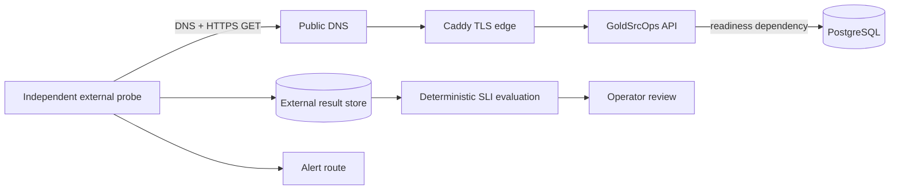

# GoldSrcOps v2.4 External Availability Monitoring

Decision date: 2026-09-04. Status: design and conditional provider selection
accepted; target configuration and the `API-01` activation window are pending.

## Purpose

The first v2.4 slice defines a provider-independent black-box measurement
contract for public GoldSrcOps API availability. The monitor must observe the
same DNS, public network, TLS, reverse-proxy, API, and PostgreSQL readiness path
as an Internet client while remaining outside the control-plane and game-host
failure domains.

This design makes the proposed `API-01` objective in
[service-level objectives](service-level-objectives.md) measurable. Decision 20
now identifies Grafana Cloud Synthetic Monitoring as the preferred shadow
candidate, subject to the
[provider decision](v2.4-synthetic-monitoring-provider-decision.md). Neither
decision activates the objective or claims that the completed v2.3 soak was a
30-day availability window.

## Goals

- Produce one unambiguous, timestamped availability result for every UTC minute.
- Retain raw per-execution results outside the production control plane.
- Distinguish user-path availability from internal telemetry health.
- Make missing measurements, retries, maintenance, and provider failures
  deterministic in the SLI denominator.
- Keep the monitor and result format replaceable so evidence survives a vendor
  change.
- Define the gates that must pass before `API-01` starts collecting an official
  window.

## Non-Goals

- High availability or multi-region failover for GoldSrcOps.
- Measuring every authenticated API workflow in this first slice.
- Treating application liveness, Prometheus scrape health, or game-server A2S
  reachability as substitutes for public API readiness.
- Running a custom probe service or adding a monitor container to the production
  Compose project.
- Retroactively converting release-soak samples into SLO evidence.

## Measurement Boundary



The designated primary probe calls
`https://api.goldsrcops.com/health/ready`. That endpoint is anonymous and
includes the PostgreSQL health check, so it represents the minimum public
control-plane path needed for useful reads and operations.

`/health/live` is probed separately for diagnosis. It can distinguish an API
process failure from a readiness dependency failure, but it is not part of the
`API-01` numerator or denominator. Internal Collector and Prometheus health
remain diagnostic for the same reason.

Exactly one monitor and one location are designated `primary` for `API-01`.
Additional locations may be configured as `diagnostic`, but their success must
not overwrite or outvote a failed primary result. Changing the primary location
requires a reviewed configuration revision and must not rewrite earlier data.

## Probe Contract

| Property | Primary value |
| --- | --- |
| Target | `https://api.goldsrcops.com/health/ready` |
| Method | `GET` without credentials or cookies |
| Schedule | Once per UTC minute |
| Timeout | 10 seconds for the complete probe |
| Redirects | Disabled; every redirect is bad |
| TLS | Trusted chain, hostname match, and certificate validity required |
| Success | DNS succeeds, TCP and TLS succeed, and the first response is HTTP `200` within the timeout |
| Response body | Not retained and not used for success |
| User agent | Stable monitor-specific value without credentials or owner data |
| Role | One designated `primary`; every other probe is `diagnostic` |

The monitor must expose raw per-execution results through an export or API. A
dashboard that exposes only an aggregate percentage is insufficient because it
cannot prove missing-slot, retry, or configuration-revision behavior.

## Canonical Result

The provider export is normalized into the following provider-independent
record. Raw records stay in an owner-controlled external store and do not enter
Git.

| Field | Meaning |
| --- | --- |
| `scheduled_at_utc` | Start of the expected minute slot |
| `started_at_utc` | Actual execution start, when available |
| `completed_at_utc` | Execution completion, when available |
| `monitor_revision` | Immutable reviewed probe-configuration revision |
| `location` | Sanitized probe-region label |
| `role` | `primary` or `diagnostic` |
| `execution_id` | Stable provider identifier or deterministic normalizer identifier used only for deduplication |
| `outcome` | Normalized result category |
| `http_status` | Status code when an HTTP response was reached |
| `duration_ms` | End-to-end duration when measured |

Allowed outcome categories are:

- `good`: the complete primary contract succeeded.
- `dns_error`: name resolution failed.
- `connect_error`: a TCP connection could not be established.
- `tls_error`: certificate, hostname, trust, or TLS negotiation failed.
- `timeout`: the complete probe exceeded 10 seconds.
- `redirect`: the first response attempted a redirect.
- `http_error`: the first response was any non-`200` status.
- `monitor_error`: the provider started an execution but could not complete it
  for an internal reason.
- `missing`: no canonical primary result arrived for the expected slot.

Only `good` enters the numerator. Every other category is bad.

When a provider does not emit an execution identifier, the normalizer derives a
stable identifier from the provider name, monitor revision, role, location,
scheduled slot, and source sample timestamp. The derivation algorithm is part
of the immutable evaluator revision. Re-exporting one source sample must produce
the same identifier, while separate attempts must not collide.

## Slot And Evaluation Rules

The activation timestamp is aligned to the start of a UTC minute. From that
timestamp, the evaluator generates one expected primary slot for every minute;
the denominator comes from those generated slots, not from the number of rows
returned by the provider.

For each slot:

1. Use the single scheduled primary execution as the canonical attempt.
2. Deduplicate repeated exports by `execution_id`.
3. Keep automatic retries as diagnostic attempts. A later successful retry does
   not replace a failed canonical attempt.
4. Allow five minutes for delayed result ingestion before classifying an absent
   result as `missing`.
5. Do not move a late result into another minute or backfill a slot from
   `/health/live`, another location, internal metrics, or operator observation.
6. Count intentionally paused monitoring and planned maintenance as bad. Record
   annotations for diagnosis without removing those slots from the headline
   SLI.
7. Count a provider outage as missing primary data. It may be reported as a
   measurement-system incident, but it is not retroactively converted to
   success.

A proven measurement defect may make the complete window invalid and require a
new prospective activation decision. It never converts a missing or failed slot
to `good`.

For a 30-day rolling window there are 43,200 expected minute slots:

```text
availability = good primary slots / 43,200
bad slots = 43,200 - good primary slots
draft target = availability >= 99.5% and bad slots <= 216
```

The evaluator runs at least daily and uses UTC boundaries. It reports both the
ratio and raw good, bad, missing, and outcome-category counts.

## Alerting Is Not The SLI

Alerting may suppress isolated failures to avoid noisy operator paging. The
initial policy should open an alert after three consecutive failed or missing
primary slots and resolve it after two consecutive good slots. This threshold
does not change the SLI: every failed or missing primary slot still consumes the
error budget.

Diagnostic `/health/live` and secondary-location results help classify an alert
as application, dependency, edge, or path-specific. They never veto the primary
result.

## Evidence Retention And Security

- Retain raw normalized results outside the control-plane failure domain for at
  least 45 days; 90 days is preferred when the selected service supports it.
- Retain the activation tuple, monitor revisions, exports, evaluator version,
  and review output together so a result can be reproduced.
- Do not retain response bodies, bearer tokens, cookies, internal telemetry
  endpoints, host addresses, provider account identifiers, or credentials.
- Keep provider credentials and alert-route secrets outside Git and outside
  public dashboards.
- Commit only the contract, evaluator logic, sanitized aggregates, and links to
  non-sensitive public evidence.

## Activation Lifecycle

`API-01` moves forward only through these stages:

1. **Draft**: this contract is reviewed; no official samples exist.
2. **Measurement ready**: a provider is selected, the primary and diagnostic
   probes are configured, raw export is reproducible, and alert and failure-path
   tests pass against a disposable or otherwise safe target.
3. **Collecting**: a 24-hour shadow run has complete expected slots and stable
   normalization. Record the activation timestamp, owner, primary location,
   monitor revision, evaluator revision, dashboard or report query, and alert
   route. The official denominator starts at that timestamp.
4. **Reviewable**: one uninterrupted prospective 30-day window has completed.
   Evaluate the unchanged target and report it as met or missed.

Changing a material probe condition after activation creates a new revision. A
change that alters the measured population or success definition requires an
explicit continuity decision and may restart the first review window.

## Provider Selection Checklist

Candidate managed synthetic-monitoring services were compared using the
following gates:

- one-minute HTTPS scheduling with a documented timeout;
- redirect rejection and normal certificate and hostname validation;
- a selectable external location outside both GoldSrcOps hosts;
- raw per-execution export or API access, including timestamps and failure
  categories;
- at least 45 days of recoverable result retention or reliable export to an
  owner-controlled store;
- configuration history or an exportable immutable revision;
- testable alert routing and an observable provider-health signal;
- account availability, legal fit, predictable price, and a documented exit
  path;
- no requirement to expose private metrics or install an agent on a production
  host.

GitHub Actions scheduled workflows are not a primary candidate because the
minimum interval is five minutes and scheduled runs can be delayed or dropped;
they cannot define the required one-minute population.
A black-box exporter colocated on the control-plane VPS is also not independent
of the service failure domain. A custom .NET probe remains deferred until a
managed option demonstrably cannot satisfy the contract.

Decision 20 conditionally selects Grafana Cloud Synthetic Monitoring for the
shadow rollout. Its minute scheduling, HTTP controls, public probes,
configuration revision, metrics API, and alerting fit the contract, but its
built-in retention does not by itself satisfy the 45-day raw-evidence gate. The
rollout must prove normalization and independent Backblaze B2 archival before
`API-01` can advance. The complete comparison, cost boundary, credential model,
and exit conditions are in the
[provider decision](v2.4-synthetic-monitoring-provider-decision.md).

## Delivery Slices

1. **Contract (accepted 2026-09-04)**: accept this provider-independent design
   and synchronize the SLO register and roadmap.
2. **Selection (accepted 2026-09-04)**: compare providers against the checklist
   and record the conditional choice and exit conditions.
3. **Target setup (in progress)**: the primary and diagnostic shadow checks were
   configured on 2026-09-04. External result retention, alert routing, and safe
   failure-path tests remain. The sanitized effective configuration is in
   `docs/v2.4-synthetic-monitoring-rollout.md`.
4. **Shadow validation**: collect 24 hours, verify expected-slot completeness,
   then record the activation tuple without importing the shadow samples.
5. **Evaluation and presentation**: implement a deterministic export evaluator
   and expose only sanitized aggregates to the later public dashboard.
6. **First review**: after a complete forward-looking 30-day window, publish the
   result and decide whether the draft target remains appropriate.

Disabling or removing the external monitor does not affect the GoldSrcOps API.
It stops valid SLI collection, and every expected primary slot remains bad until
a reviewed measurement path resumes.

## Verification Matrix

| Area | Required evidence before activation |
| --- | --- |
| Healthy path | DNS and trusted TLS succeed; `/health/ready` returns `200`; one `good` primary result is exported |
| Failure classification | Safe tests demonstrate DNS, TLS, timeout, redirect, and non-`200` normalization without mutating production |
| Missing data | An omitted fixture becomes `missing` after the grace period and reduces availability |
| Retry behavior | A successful retry remains diagnostic and does not replace the failed canonical attempt |
| Slot population | A generated 24-hour fixture produces exactly 1,440 expected slots independent of exported row count |
| Budget boundary | 216 bad slots pass 99.5%; 217 bad slots fail it in a 43,200-slot window |
| Alert routing | Three consecutive bad slots notify the intended route and two good slots resolve it |
| Retention | Raw export, monitor revision, and evaluator inputs can be recovered after the shadow period |
| Isolation | A control-plane outage cannot erase or prevent retrieval of already stored probe results |

## References

- [Google SRE Workbook: Implementing SLOs](https://sre.google/workbook/implementing-slos/)
- [Google SRE Workbook: Alerting on SLOs](https://sre.google/workbook/alerting-on-slos/)
- [Prometheus multi-target exporter pattern](https://prometheus.io/docs/guides/multi-target-exporter/)
- [Prometheus blackbox exporter configuration](https://github.com/prometheus/blackbox_exporter/blob/master/CONFIGURATION.md)
- [GitHub Actions scheduled workflow limits](https://docs.github.com/en/actions/reference/workflows-and-actions/events-that-trigger-workflows#schedule)
